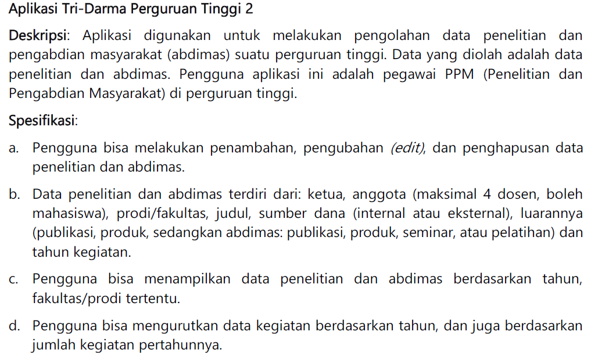

# Aplikasi Tri-Darma Perguruan Tinggi 2



## Kelompok 7
- Ahmad Daffa Aminuddin Siregar (NIM: 103012300198)
- Muhammad Hafiz Fahrial (NIM: 103012300217)

## Deskripsi
Aplikasi ini digunakan untuk melakukan pengolahan data penelitian dan pengabdian masyarakat (abdimas) suatu perguruan tinggi. Data yang diolah adalah data penelitian dan abdimas. Pengguna aplikasi ini adalah pegawai PPM (Penelitian dan Pengabdian Masyarakat) di perguruan tinggi.


## Spesifikasi

a. Pengguna bisa melakukan penambahan, pengubahan (edit), dan penghapusan data penelitian dan abdimas.

b. Data penelitian dan abdimas terdiri dari: ketua, anggota (maksimal 4 dosen, boleh mahasiswa), prodi/fakultas, judul, sumber dana (internal atau eksternal), luaran (publikasi, produk, seminar, atau pelatihan) dan tahun kegiatan.

c. Pengguna bisa menampilkan data penelitian dan abdimas berdasarkan tahun, fakultas/prodi tertentu.

d. Pengguna bisa mengurutkan data kegiatan berdasarkan tahun, dan juga berdasarkan jumlah kegiatan pertahunnya.

## Cara Kerja Project

1. *Menambahkan Data:*
   - Pengguna dapat menambahkan data baru untuk penelitian atau abdimas.
   - Data yang ditambahkan termasuk jenis, ketua, anggota, prodi/fakultas, judul, sumber dana, luaran, dan tahun kegiatan.
   - Terdapat validasi untuk memastikan jumlah anggota tidak melebihi 4.

2. *Mengubah Data:*
   - Pengguna dapat mengubah data yang sudah ada berdasarkan jenis dan judul.
   - Bagian yang dapat diubah termasuk ketua, anggota, prodi/fakultas, judul, sumber dana, luaran, dan tahun kegiatan.

3. *Menghapus Data:*
   - Pengguna dapat menghapus data berdasarkan judul.
   - Penghapusan data dilakukan dengan metode menimpa jika data bukan yang terakhir atau menjadikan himpunan kosong jika data terakhir.

4. *Menampilkan Data:*
   - Pengguna dapat menampilkan semua data atau berdasarkan filter tertentu (jenis, tahun, prodi/fakultas).

5. *Mengurutkan Data:*
   - Data dapat diurutkan berdasarkan tahun kegiatan secara ascending atau descending.

## Cara Mendownload Project dari GitHub

1. Buka halaman GitHub repository.
2. Klik tombol Code di bagian atas daftar file.
3. Pilih salah satu opsi untuk mendownload:
   - *HTTPS:* Klik tombol Download ZIP untuk mendownload seluruh repository sebagai file ZIP.
   - *SSH:* Salin URL SSH untuk repository jika Anda menggunakan kunci SSH.
   - *GitHub CLI:* Salin perintah GitHub CLI untuk repository jika Anda menggunakan GitHub CLI.

4. Jika Anda menggunakan Git, Anda bisa meng-clone repository dengan perintah berikut di terminal:
   ```bash
   git clone <URL repository>
